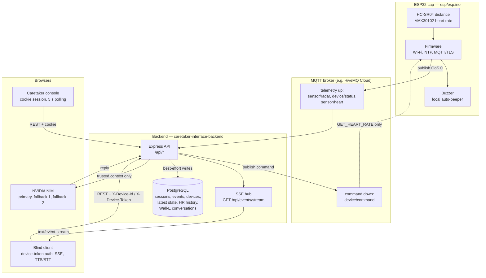

# Smart Assistive Cap — "Blind Guardian"

An assistive-wearable prototype for visually impaired navigation and emergency alerting.
The cap's ESP32 sensors (ultrasonic distance, MAX30102 heart rate, buzzer) stream telemetry
over MQTT to a Node.js/Express backend, which fans it out to two browser clients:

- a **caretaker console** that monitors one or more blind users and can acknowledge/resolve alerts, and
- a **blind-person client** (voice-first) that speaks obstacle warnings aloud, raises SOS alerts, and
  holds a spoken conversation with a server-side AI assistant ("Wall-E").

The phone is the authoritative GPS source. Events that arrive without coordinates are enriched
with the latest phone location; no coordinates are ever invented.

---

## Status at a glance

| Area | State |
| --- | --- |
| Caretaker console (auth, multi-user scoping, map, alerts, devices, heart rate, Wall-E history viewer) | Implemented |
| Blind client (obstacle TTS, voice SOS, hands-free mode, location sharing, Wall-E voice chat, buzzer voice commands) | Implemented, browser-dependent |
| Blind-client voice command "buzzer on / buzzer off" | **Not effective on hardware** — the firmware ignores these commands (see [Known limitations](#known-limitations)) |
| ESP32 → backend MQTT telemetry (radar, device status, heart rate) | Implemented |
| Backend → ESP32 `GET_HEART_RATE` command | Implemented, correlated by `requestId` |
| Backend → ESP32 `BUZZER_ON` / `BUZZER_OFF` command | Published by the backend, **ignored by the firmware** |
| MQTT topics for SOS, phone location, fall, generic alerts, `sensor/distance` | Backend handles them; **no producer exists in this repository** |
| Wall-E AI (NVIDIA NIM, 3-model fallback, trusted telemetry context) | Implemented; requires `NVIDIA_API_KEY` |
| Database persistence (events, runtime snapshot, heart-rate history, Wall-E conversations) | Implemented, best-effort, requires `DATABASE_URL` |
| Automated tests | 10 integration harnesses, no unit-test framework, no coverage tooling |
| Deployment configuration (Docker/CI/Render/Vercel files) | **None in the repository** — see [Deployment](#deployment) |

---

## Repository layout

```
.
├── README.md                     # this file
├── .gitignore
├── caretaker-interface-backend/  # Node.js + Express API, MQTT bridge, PostgreSQL
│   ├── server.js                 # single entry point: routes, SSE, MQTT, runtime state
│   ├── security-headers.js
│   ├── .env.example              # documented environment variables
│   ├── package.json              # scripts + runtime dependencies
│   ├── ai/                       # NVIDIA provider, model fallback, system prompt, session store
│   ├── auth/                     # sessions, password hashing, rate limiting, authorization
│   ├── care/                     # blind users, caretaker↔user relationships
│   ├── db/                       # lazy pool + migration runner
│   ├── devices/                  # pairing tokens, device authentication, CRUD
│   ├── heart-rate/               # on-demand heart-rate monitoring engine
│   ├── mqtt/                     # broker client, topic registry, payload parsing
│   ├── migrations/               # 001..005 SQL
│   ├── scripts/                  # integration test harnesses
│   ├── telemetry/                # persistence queries + bounded write queue
│   ├── API_CONTRACT.md           # (partly outdated — see limitations)
│   └── README.md                 # (partly outdated — see limitations)
├── caretaker-interface-frontend/ # static HTML/CSS/JS — no build step, no dependencies
│   ├── auth.html / auth.js       # caretaker login + registration
│   ├── index.html / script.js    # caretaker console
│   ├── style.css
│   └── blind-client/             # blind-person voice client (own HTML/CSS/JS)
└── esp/
    └── esp.ino                   # ESP32 firmware (Arduino)
```

---

## Architecture



Every node is declared once, and each edge references a node declared above it. The diagram
deliberately omits the five MQTT topics that the backend subscribes to but that nothing in this
repository publishes — those are listed in [Known limitations](#known-limitations).

### Data flow at a glance

1. The cap measures distance continuously and publishes a radar reading roughly every 200 ms.
2. The backend turns two consecutive in-range readings in the same severity band into a single
   `OBSTACLE` event (with a re-alert cooldown for band changes) and broadcasts it over SSE.
3. The blind client receives the event, drops stale/duplicate alerts, and speaks it with the
   Web Speech API.
4. The caretaker console polls the same events and shows them on a Leaflet map with
   acknowledge/resolve actions.
5. A caretaker can trigger a demo event for a registered device, or ask the device for a fresh
   heart-rate reading; the backend issues `GET_HEART_RATE` over MQTT and correlates the reply.

---

## Tech stack

| Layer | Choice |
| --- | --- |
| Backend runtime | Node.js, CommonJS, no transpiler, no framework generator |
| HTTP | Express `5.2.1`, `cors`, `cookie-parser`, `express.json()` |
| Database | PostgreSQL via `pg` (raw parameterized SQL, no ORM) |
| Realtime | Server-Sent Events only; no WebSocket code in the backend or either frontend |
| IoT transport | `mqtt` client, QoS 0, optional TLS |
| Crypto | `bcryptjs` for password/device-secret hashes; SHA-256 for session digests; 256-bit random tokens via `crypto` |
| AI | Direct HTTPS calls to NVIDIA's chat-completions endpoint (no SDK) |
| Frontend | Plain HTML/CSS/JavaScript. Leaflet `1.9.4` and Google Fonts from CDNs, with SRI on the Leaflet bundle |
| Firmware | ESP32 + Arduino core; `PubSubClient`, `Wire`, `MAX30105` + `heartRate` libraries |

Runtime dependencies are the six packages listed in `caretaker-interface-backend/package.json`
(`express`, `cors`, `cookie-parser`, `pg`, `mqtt`, `bcryptjs`). `package.json` declares no
`devDependencies` and no lint, type-check or build scripts.

---

## Prerequisites

- **Node.js** — `npm start` runs `node server.js` and needs nothing special. Every other script
  (`start:env`, `migrate`, all tests) uses `node --env-file-if-exists`, which requires a Node
  release that provides that flag; it was verified working on Node 24.13.0, but it is not covered
  by the `Node 20.6+` the backend README claims. `package.json` declares no `engines` field.
- **PostgreSQL 13+** (for `gen_random_uuid()`; the migrations are written against a PostgreSQL 18
  target). Optional for `/api/health` and MQTT/SSE behaviour, **required** for authentication,
  device management, and persistence.
- **An MQTT broker** with TLS — optional. Without `MQTT_BROKER_URL` the backend logs a warning and
  runs without MQTT.
- **An NVIDIA API key** from build.nvidia.com — only for Wall-E AI.
- **Arduino IDE + ESP32 board package** for the firmware. The firmware additionally needs
  `PubSubClient`, plus the `MAX30105` and `heartRate` libraries from the SparkFun MAX30102 library
  (only if a MAX30102 is fitted).
- A modern browser for the frontends. The blind client additionally needs
  `speechSynthesis`, `SpeechRecognition` (Chrome/Edge/Safari) and `geolocation`, so it must be
  served over **HTTPS or `http://localhost`** (a phone on a LAN IP will have geolocation and
  microphone blocked).

---

## Quick start

### 1. Backend

```bash
cd caretaker-interface-backend
npm install
cp .env.example .env      # then edit .env
npm run migrate           # apply migrations (needs DATABASE_URL)
npm run start:env         # loads .env, listens on http://localhost:3000
```

`npm start` runs `node server.js` and does **not** load `.env`; export the variables yourself or
use `start:env`.

Verify:

```bash
curl http://localhost:3000/api/health
# {"status":"ok","mqtt":"disabled"|"connected"|...,"deviceStatus":null}
```

### 2. Frontend

The frontends are static files — no build, no package manager. Serve the
`caretaker-interface-frontend` directory over HTTP:

```bash
# pick any static server, e.g.
npx serve caretaker-interface-frontend -l 5500
# or: python -m http.server 5500 --directory caretaker-interface-frontend
```

Open `http://localhost:5500/auth.html`, register a caretaker account (registration only accepts
the `CARETAKER` role), and sign in.

To point the console at a different backend, edit the `window.API_BASE_URL` assignment near the
bottom of `caretaker-interface-frontend/index.html` and `auth.html`.

### 3. CORS

The backend **fails closed**: with `CORS_ORIGIN` unset only `http://localhost:5500` and
`http://127.0.0.1:5500` are allowed. Use a comma-separated list for anything else, e.g.
`CORS_ORIGIN=https://caretaker-interface-demo-frontend.vercel.app`. A wildcard is never used
because cookie credentials are enabled.

### 4. ESP32 firmware

1. Open `esp/esp.ino` in the Arduino IDE.
2. Replace the hardcoded Wi-Fi/MQTT credentials and the device identifier (see
   [Known limitations](#known-limitations) — these are committed secrets).
3. Select an ESP32 board and upload. Open Serial at 115200 baud to watch the boot log.
4. The MQTT `deviceId` in the firmware must match a `deviceIdentifier` registered through
   `POST /api/devices` so MQTT events can be attributed to a blind user.

### End-to-end first run

1. Register a caretaker, then create a blind user from the console (**Add user**).
2. Register a device for that user and copy the pairing token (shown once).
3. On the blind client's page, enter the device identifier and token (**Pair this phone**).
4. Enable voice alerts, share location, then use the demo controls to inject an `OBSTACLE` or
   `HEART_RATE` event, or use the caretaker's **Simulate** panel in the console.

---

## Configuration

### Backend environment variables

All variables are read from `process.env` at boot. `.env.example` documents most of them but
contains some stale comments (see [Known limitations](#known-limitations)).

| Variable | Default | Purpose |
| --- | --- | --- |
| `PORT` | `3000` | HTTP listen port |
| `NODE_ENV` | unset | `production` forces `Secure` cookies and enables HSTS |
| `CORS_ORIGIN` | local dev origins only | Comma-separated allowlist; unset = fail closed |
| `TRUST_PROXY` | unset | `X-Forwarded-For` trust: positive hop count, or `loopback`/`linklocal`/`uniquelocal`; other values are rejected |
| `REQUIRE_AUTH_FOR_READS` | `false` | `true` requires a caretaker cookie on the otherwise-public read endpoints (**breaks the blind client**) |
| `SSE_MAX_CLIENTS` | `30` | Concurrent SSE streams per instance; excess gets `503` |
| `EVENTS_WINDOW_MAX` | `100` | Bounded event list size returned by `GET /api/events` |
| `TELEMETRY_QUEUE_MAX` | `500` | Max queued DB writes while PostgreSQL is down; oldest dropped on overflow |
| `DATABASE_URL` | unset | PostgreSQL connection string; required for auth, devices, relationships, persistence |
| `SESSION_COOKIE_NAME` | `bg_session` | Session cookie name |
| `SESSION_TTL_MS` | `604800000` (7 days) | Session lifetime |
| `COOKIE_SECURE` | auto | `true` forces `Secure`; otherwise auto-enabled in production/HTTPS |
| `BCRYPT_ROUNDS` | `10` | Password and device-secret cost (4–15) |
| `AUTH_RATE_MAX` | `20` | Login attempts per IP per window |
| `AUTH_RATE_WINDOW_MS` | `900000` (15 min) | Auth rate-limit window |
| `DEVICE_TOUCH_THROTTLE_MS` | `300000` (5 min) | Minimum interval between `last_seen_at` writes for the same device |
| `DEVICE_WRITE_RATE_WINDOW_MS` | `60000` | Window for per-device write limits |
| `DEVICE_EVENTS_RATE_MAX` | `120` | `POST /api/events` limit per device per window |
| `DEVICE_LOCATION_RATE_MAX` | `120` | `POST /api/location` limit per device per window |
| `DEVICE_BUZZER_RATE_MAX` | `60` | `POST /api/buzzer` limit per device per window |
| `MQTT_BROKER_URL` | unset | e.g. `mqtts://<broker-host>:8883`; unset disables MQTT |
| `MQTT_USERNAME` / `MQTT_PASSWORD` | unset | Broker credentials |
| `MQTT_CLIENT_ID` | auto | Defaults to `caretaker-backend-<random>` |
| `NVIDIA_API_KEY` | unset | Required for Wall-E; never reaches the browser |
| `WALLE_MODEL_PRIMARY` | `nvidia/nemotron-3.5-lightning-30b-a3b` | First model tried |
| `WALLE_MODEL_FALLBACK_1` | `nvidia/nemotron-3-super-120b-a12b` | Second model tried |
| `WALLE_MODEL_FALLBACK_2` | `deepseek-ai/deepseek-v4-flash-0731` | Third model tried |
| `WALLE_AI_TIMEOUT_MS` | `10000` | Per-model request timeout |
| `WALLE_MAX_MESSAGE_LENGTH` | `1000` | Max characters per chat message |
| `WALLE_SESSION_MAX_TURNS` | `20` | Retained user+assistant turns per session |
| `WALLE_SESSION_TTL_MS` | `86400000` (24 h) | Session idle TTL |
| `WALLE_MAX_SESSIONS` | `100` | Max tracked sessions; oldest inactive dropped |
| `HEART_RATE_NORMAL_INTERVAL_MS` | `120000` (2 min) | Automatic per-device HR request cadence |
| `HEART_RATE_HIGH_INTERVAL_MS` | `120000` (2 min) | Cadence after an abnormal reading (**same as normal by default**) |
| `HEART_RATE_RECOVERY_NORMAL_READINGS` | `3` | Consecutive normal readings before returning to normal cadence |
| `HEART_RATE_REQUEST_TIMEOUT_MS` | `15000` | Wait for a device's reply before giving up |
| `HEART_RATE_HISTORY_WINDOW` | `200` | In-memory per-device history window |
| `OBSTACLE_REALERT_COOLDOWN_MS` | `3000` | Backstop against band-boundary flapping |

Values hardcoded in `server.js` (not configurable): heart-rate alert thresholds (`< 60` low,
`> 100` high) and the 30 s HR event cooldown; `EVENT_MESSAGE_MAX = 256`; Wall-E chat limit
`30`/min per IP; caretaker simulation limit `60`/min per account; registration limit `10`/15 min
per IP; obstacle thresholds (`150` / `90` / `50` cm) and the 2-consecutive-reading rule.

### Frontend configuration

The frontends read one global, `window.API_BASE_URL`, set inline in the HTML (not an env file):

| Page | Fallback in `script.js` | `window.API_BASE_URL` in HTML |
| --- | --- | --- |
| `index.html` (console) | `http://<current hostname>:3000` | set to the Render deployment |
| `auth.html` | same | set to the Render deployment |
| `blind-client/index.html` | `http://localhost:3000` | **not set** — see limitations |

`localStorage` keys used:

| Key | Client | Purpose |
| --- | --- | --- |
| `caretaker.selectedBlindUserId` | console | Currently selected blind user |
| `caretaker.selectedDeviceId` | console | Currently selected device |
| `bg_device_id` | blind client | Paired device identifier |
| `bg_device_token` | blind client | Paired device token (plaintext) |

---

## HTTP API

All responses are JSON. Unknown routes return `404 {"error":"Route not found"}`; malformed JSON
returns `400`; oversized bodies return `413`.

`Public*` = public by default, but requires an authenticated `CARETAKER` cookie when
`REQUIRE_AUTH_FOR_READS=true`.
`Device` = `X-Device-Id` + `X-Device-Token` headers.
`Caretaker` = `bg_session` cookie (or `SESSION_COOKIE_NAME`).
Scoped read endpoints additionally require an `ACTIVE` caretaker↔blind-user relationship and return
`404` for unrelated users rather than leaking existence.

### Health, events, location

| Method | Path | Auth | Purpose |
| --- | --- | --- | --- |
| GET | `/api/health` | Public* | `status`, MQTT state, latest device status |
| GET | `/api/events` | Public* | Bounded event list. `?blindUserId=` scopes to one user (caretaker + relationship); `?deviceId=` narrows further and requires a `blindUserId` context |
| POST | `/api/events` | Device | Create an event (`201`; `409` on duplicate `alertId`) |
| PATCH | `/api/events/:alertId` | Caretaker or owning device | Set `ACKNOWLEDGED` / `RESOLVED`; invalid transitions return `409` |
| GET | `/api/location` | Public* | Latest location, or `{latitude:null,longitude:null,timestamp:null}` |
| POST | `/api/location` | Device | Publish phone GPS |
| GET | `/api/events/stream` | Public* | SSE (`text/event-stream`, `retry: 3000`); capped by `SSE_MAX_CLIENTS` |
| GET | `/api/buzzer` | Public* | Last command the **backend** published + MQTT state |
| POST | `/api/buzzer` | Device | Publish `BUZZER_ON` / `BUZZER_OFF`; `503` if MQTT is not connected (no fake state is recorded) |

**Event schema** — `alertId` (unique, required), `trigger`, `status`, `heartRate` (number or
`null`), `latitude`/`longitude` (optional; enriched from the latest phone location, otherwise
`400 Location unavailable`), `timestamp` (ISO-8601), optional `message` (max 256 chars) and
`distance` (obstacle events).

| Trigger | Meaning |
| --- | --- |
| `SOS` | Emergency button / voice SOS |
| `HEART_RATE` | Heart-rate reading (optionally abnormal) |
| `SOS_AND_HEART_RATE` | SOS with a reading attached |
| `NORMAL` | Non-emergency informational event |
| `OBSTACLE` | Forward ultrasonic detection with `distance` in cm |

Status flow: `ACTIVE → ACKNOWLEDGED → RESOLVED`, with `ACTIVE → RESOLVED` also allowed. `NORMAL`
events cannot become active alerts.

### Accounts and relationships

| Method | Path | Auth | Purpose |
| --- | --- | --- | --- |
| POST | `/api/auth/register` | Public (rate-limited) | Create a **caretaker** account and session |
| POST | `/api/auth/login` | Public (rate-limited) | Set the session cookie |
| POST | `/api/auth/logout` | Public | Clear the session cookie |
| GET | `/api/auth/me` | Caretaker | Current identity |
| POST | `/api/blind-users` | Caretaker | Create a blind user and link it to the caretaker |
| GET | `/api/blind-users` | Caretaker | List monitored users |
| GET | `/api/blind-users/:blindUserId` | Caretaker + relationship | One user |
| PATCH | `/api/blind-users/:blindUserId` | Caretaker + relationship | Update the user |
| GET | `/api/caretaker/blind-users` | Caretaker | Dashboard view: users, devices, status |
| POST | `/api/caretaker/lookup-user` | Caretaker | Find a linkable account by email |
| POST | `/api/caretaker/blind-users/:blindUserId` | Caretaker | Link an existing user |
| DELETE | `/api/caretaker/blind-users/:blindUserId` | Caretaker | Unlink |

### Devices

| Method | Path | Auth | Purpose |
| --- | --- | --- | --- |
| POST | `/api/devices` | Caretaker | Register a device; the plaintext token is returned **once** (`201`, `409` if the identifier exists) |
| GET | `/api/devices` | Caretaker | List visible devices; `?blindUserId=` filters |
| GET | `/api/devices/:deviceId` | Caretaker | One device (safe shape; never returns the secret) |
| POST | `/api/devices/:deviceId/rotate` | Caretaker | Rotate the token; the previous one stops working immediately |
| DELETE | `/api/devices/:deviceId` | Caretaker | Remove a device |

`deviceIdentifier` must match `^[A-Za-z0-9][A-Za-z0-9._:/-]{0,63}$`.

Device-authenticated calls return an identical `401` for missing, malformed, wrong or unknown
credentials. Request bodies can never override the authenticated identity.

### Heart rate (caretaker → one device)

| Method | Path | Auth | Purpose |
| --- | --- | --- | --- |
| POST | `/api/caretaker/devices/:deviceId/heart-rate-request` | Caretaker | Issue one `GET_HEART_RATE` over MQTT and await the correlated reply; `503` if MQTT is unavailable, `504` on timeout, `200` with `pending: true` when it joined an in-flight request |
| GET | `/api/caretaker/devices/:deviceId/heart-rate` | Caretaker | Latest reading plus monitoring mode |
| GET | `/api/caretaker/devices/:deviceId/heart-rate/history` | Caretaker | Device-scoped history; `?limit=` defaults to 50 and is capped at 200 |

A click that lands while a request is already pending joins the existing request instead of
publishing a second command.

### Wall-E AI

| Method | Path | Auth | Purpose |
| --- | --- | --- | --- |
| POST | `/api/walle/chat` | Device | `{sessionId, message}` → `{sessionId, reply, timestamp, model}`; `400` invalid input, `404` session not owned by this device, `429` rate limited, `503` all models failed |
| GET | `/api/walle/sessions` | Caretaker | Session summaries (newest first); `?blindUserId=` scopes |
| GET | `/api/walle/history/:sessionId` | Caretaker | Full transcript; never creates a session |

### Demo

| Method | Path | Auth | Purpose |
| --- | --- | --- | --- |
| POST | `/api/caretaker/simulate-event` | Caretaker | Inject a `SOS` / `HEART_RATE` / `SOS_AND_HEART_RATE` event for a registered device. `NORMAL` and `OBSTACLE` are rejected — obstacle events must come from a real radar reading |

---

## MQTT

The backend connects only when `MQTT_BROKER_URL` is set. It uses QoS 0, an optional username and
password, a 15 s connection timeout and a 5 s reconnect interval. Unparseable payloads are logged
and ignored. MQTT is an **additional** input channel — REST, SSE and the in-memory hot path work
without it.

### Topics and who actually uses them

| Topic | Backend subscribes | ESP32 publishes | Notes |
| --- | --- | --- | --- |
| `blindguardian/sensor/radar` | Yes | **Yes** (~200 ms) | 2 consecutive in-range same-band readings → one `OBSTACLE` event |
| `blindguardian/device/status` | Yes | **Yes** | Tracked in memory and persisted; surfaced on `/api/health` |
| `blindguardian/sensor/heart` | Yes | **Yes** | Continuous samples and on-demand command replies |
| `blindguardian/device/command` | No (publishes) | No (subscribes) | Backend → cap commands |
| `blindguardian/emergency/sos` | Yes | No | Creates an `SOS` event if the payload has a device or message |
| `blindguardian/mobile/location` | Yes | No | Same latest-location store as `POST /api/location` |
| `blindguardian/mobile/fall` | Yes | No | Stored in memory and in `latest_states`, then logged — there is no `FALL` trigger in the event model, so it is never broadcast |
| `blindguardian/alerts` | Yes | No | Routed into the event flow only if the payload already carries a valid trigger; otherwise logged |
| `blindguardian/sensor/distance` | Yes | No | **Logged only** — obstacle events come from `sensor/radar` |

MQTT messages carry a `deviceId`; the backend resolves it to the registered device's owner so the
event appears in that user's scoped feed. An unknown identifier is never attached to a user.
There are **no per-device broker credentials or ACLs** — every cap shares one username/password and
the backend trusts the `deviceId` in the payload.

### Payloads the ESP32 sends

```jsonc
// blindguardian/sensor/radar  (every ~200 ms)
{ "deviceId": "BG001", "distance": 80.0, "danger": "CRITICAL", "timestamp": "2026-01-01T00:00:00Z" }

// blindguardian/device/status  (on MQTT connect, and retried once NTP has synced)
{ "deviceId": "BG001", "status": "ONLINE", "wifi": "CONNECTED", "timestamp": "..." }

// blindguardian/sensor/heart  (continuous 30 s session)
{ "deviceId": "BG001", "sessionId": 7, "heartRate": 72.4, "timestamp": "...", "sessionActive": true }

// blindguardian/sensor/heart  (reply to a GET_HEART_RATE command, exactly once)
{ "deviceId": "BG001", "heartRate": 72.4, "timestamp": "...", "requestId": "…", "sessionActive": false }
```

`danger` is a firmware-side label (`< 0` → `CLEAR`, `<= 100` → `CRITICAL`, `<= 150` → `HIGH`,
`<= 200` → `MEDIUM`, otherwise `LOW`). The backend ignores it and derives its own bands from
`distance`, so the two labelling schemes never have to agree.

### Payloads the backend sends

```jsonc
// blindguardian/device/command — buzzer
{ "command": "BUZZER_ON" | "BUZZER_OFF", "issuedAt": "..." }

// blindguardian/device/command — heart rate
{ "command": "GET_HEART_RATE", "deviceId": "BG001", "requestId": "…", "issuedAt": "..." }
```

### Obstacle severity bands

Bands are computed by the backend from `distance` and are the source of truth for whether an
event is created at all:

| Distance | Band | Event | Buzzer in firmware |
| --- | --- | --- | --- |
| `> 150` cm or no echo | clear | none | silent |
| `91`–`150` cm | moderate | yes | slow beeps |
| `51`–`90` cm | close | yes | fast beeps |
| `≤ 50` cm | very close | yes | continuous |

---

## ESP32 firmware

`esp/esp.ino` is a single-file Arduino sketch.

### Hardware

| Part | Pins |
| --- | --- |
| HC-SR04 (forward-facing only) | `TRIG` = GPIO 5, `ECHO` = GPIO 18 |
| Active buzzer | GPIO 19 |
| MAX30102 (I²C) | `SDA` = GPIO 21, `SCL` = GPIO 22 |
| Onboard LED | GPIO 2 |
| Serial | 115200 baud |

Maximum measurable range is 400 cm; readings outside `0`–`400` cm are treated as "no echo".

### Behaviour

- **Wi-Fi + NTP** — connects at boot, retries every 10 s if the link drops, re-syncs the clock
  every 30 s until valid. **No message is ever published with an empty or 1970 timestamp**; an
  `ONLINE` status that could not be published before NTP synced is retried afterwards.
- **MQTT/TLS** on port 8883, reconnect every 5 s. Reconnects re-subscribe to
  `blindguardian/device/command`.
- **Obstacle loop** — measures continuously, drives the local buzzer from the band, and publishes
  a radar reading every 200 ms.
- **Heart rate** — the MAX30102 is optional; if it is absent, heart monitoring is disabled and
  everything else keeps working. A 30 s measurement session is followed by a 2 min wait, starting
  immediately after the first MQTT connection. A beat is accepted when the inter-beat interval is
  300–2000 ms (≈30–200 BPM) and the derived BPM is within 30–220, with finger presence detected
  above an IR threshold of 50000. Beat detection runs on a FreeRTOS task with an 8 KB stack and no
  core affinity.
- **On-demand reading** — a `GET_HEART_RATE` command whose `deviceId` matches and which carries a
  `requestId` stops the continuous session, waits for a **fresh** beat, and publishes exactly one
  reply echoing the `requestId`. A 15 s deadline abandons the command so continuous monitoring can
  resume. Duplicate commands while one is pending are ignored. A `requestId` is mandatory.
- **Servo** — deliberately removed; the sketch prints `Servo: DISABLED`.

### Firmware configuration to change before deployment

`esp.ino` hardcodes the Wi-Fi SSID and password, the MQTT broker hostname, username, password,
client id and the device identifier. Treat all of them as **published secrets**: rotate them and
move them into a separate, uncommitted header before using this outside a bench test.

---

## Database

PostgreSQL is accessed through a lazy pool — importing the modules does not require
`DATABASE_URL`, but any database-backed operation does, and authorization **fails closed** when the
database is unreachable.

### Migrations

```bash
npm run migrate          # apply pending migrations
npm run migrate:status   # list applied migrations
```

Migrations live in `caretaker-interface-backend/migrations/` (not `db/migrations/`), are applied in
filename order, each inside a transaction, and are recorded in `schema_migrations`.

| File | Contents |
| --- | --- |
| `001_initial_schema.sql` | `users`, `sessions`, `care_relationships`, `devices`, `walle_sessions`, `walle_messages`, `events`; `updated_at` trigger |
| `002_device_auth.sql` | `devices.secret_hash`, `last_seen_at`; status constrained to `ONLINE` / `OFFLINE` / `ERROR` |
| `003_sensor_persistence.sql` | `events.device_identifier` / `blind_user_identifier`; `walle_sessions.client_session_id` (unique); single-row `latest_states` (`location`, `device_status`, `heart_rate`, `fall` as `JSONB`, `buzzer` as `TEXT`) |
| `004_heart_rate_history.sql` | `heart_rate_history` with per-device readings and classification |
| `005_obstacle_single_trigger.sql` | Replaces directional obstacle triggers with a single `OBSTACLE` trigger |

`users.role` is constrained to `BLIND_USER` or `CARETAKER`, and email uniqueness is
case-insensitive.

### Persistence model

The **in-memory maps are the request hot path**. PostgreSQL is written to asynchronously through a
bounded FIFO queue (`TELEMETRY_QUEUE_MAX`, default 500, oldest dropped on overflow) whose SQL
operations are idempotent, so retries cannot duplicate or corrupt telemetry. At boot the server
rehydrates recent events, the latest-state snapshot, the highest used MQTT sequence number, Wall-E
conversations and the heart-rate monitoring engine; if the database is unavailable it starts empty
and logs a warning.

`latest_states` is a **single logical row** (`id = 1`), so the latest location, device status, fall
and buzzer state are system-wide. Scoped reads attribute them to a user where an identity is
available, and otherwise return `null` placeholders.

### Heart-rate monitoring engine

On boot every registered device is adopted into the monitoring engine and scheduled. The engine
issues `GET_HEART_RATE` on the configured cadence, escalates to the high-frequency cadence after any
abnormal reading (`< 60` or `> 100` BPM), and returns to normal after
`HEART_RATE_RECOVERY_NORMAL_READINGS` consecutive normal ones. Automatic requests never overlap;
a manual caretaker request that coincides with a pending one joins it. A device with no MAX30102
simply times out and reschedules — it never raises an alert.

---

## Wall-E AI

`POST /api/walle/chat` runs entirely server-side; the browser never holds an API key.

- **Models** are tried in order, with fallback limited to transient failures (timeouts, rate
  limits, 5xx). A non-transient error stops the chain immediately. When all models fail the
  endpoint returns `503 AI_PROVIDER_UNAVAILABLE`.
- **Trusted context** is assembled per request and scoped to the authenticated device — location,
  device status, heart rate, latest obstacle and latest fall, each with a freshness limit (2 min for
  device status and heart rate, 5 min for location, 30 s for obstacles, 10 min for fall) so stale
  data is described as stale rather than presented as current. State that cannot be attributed to
  the requesting device is omitted rather than guessed.
- **The system prompt** restricts the assistant to the supplied telemetry, keeps replies short and
  speech-friendly, and forbids autonomous safety actions.
- **Sessions** are held in memory (hot path) and mirrored to PostgreSQL in the background, so they
  survive a restart; failures to mirror never block a reply. Retention: 20 turns per session,
  24 h idle TTL, 100 sessions, pruned lazily. A session is always bound to the device that created
  it — a mismatched `sessionId` answers `404`.

---

## Security

| Control | Implementation |
| --- | --- |
| Session tokens | 256-bit random token in an `HttpOnly` cookie; only a SHA-256 digest is stored. `Secure` + `SameSite=None` in production, `SameSite=Lax` in development; 7-day expiry; logout deletes the row |
| Passwords | bcrypt, cost 4–15 (default 10); minimum 8 characters, maximum 72 bytes (bcrypt's own ceiling) |
| Device auth | bcrypt-hashed secrets, returned once at registration; identical `401` for every failure mode |
| Authorization | Identity is always resolved from the database, never from the request body. Scoped reads require an `ACTIVE` caretaker↔user relationship and return `404` (not `403`) for unrelated resources so existence is not leaked |
| CORS | Explicit allowlist, credentials enabled, fails closed to local origins when unset |
| Rate limits | Login `20`/15 min per IP; register `10`/15 min per IP; Wall-E chat `30`/min per IP; caretaker demo `60`/min per account; device writes per **device identity** (events `120`, location `120`, buzzer `60` per minute) |
| Headers | `X-Content-Type-Options: nosniff`, `X-Frame-Options: DENY`, `Referrer-Policy: no-referrer`, HSTS when `NODE_ENV=production` or HTTPS |
| Input validation | UUID/identifier patterns, coordinate ranges, ISO-8601 timestamps, ISO length allowlist, fixed enum allowlists for `trigger`/`status`/`command`, 256-char event message cap, and a 300-byte MQTT command buffer in the firmware |
| MQTT | No per-device identity or ACLs; a shared broker credential trusts the `deviceId` in the payload |
| Transport | Backend CORS/HSTS support TLS; the firmware disables TLS certificate verification |

Deliberately absent: **no Content-Security-Policy** (the static frontends use inline scripts and CDN
assets, so a strict policy would break them), **no CSRF tokens** (writes are cookie-authenticated
`POST`/`PATCH`/`DELETE` requests with no CSRF protection), and **no distributed rate limiting**
(all limits are in-memory and per-instance, so they reset on restart and are not shared across
replicas).

---

## Testing

There is no test framework, no unit-test layer, and no coverage configuration. What exists is ten
integration harnesses in `caretaker-interface-backend/scripts/`. Each one:

- loads `.env` and **exits immediately unless `DATABASE_URL` is set**,
- boots the real server (usually in-process, via the exported `app`),
- creates its own throwaway users/devices, and
- purges its own rows afterwards.

Seven of the ten clear `MQTT_BROKER_URL` and stub the MQTT publish path through the module's test
seam, so **no broker is required**; three of those additionally blank `NVIDIA_API_KEY`.

```bash
cd caretaker-interface-backend
npm run test:auth      # caretaker accounts, sessions, hashing, rate limiting
npm run test:stage3    # blind-user management and caretaker authorization
npm run test:stage4    # device pairing, rotation and blind-client authentication
npm run test:stage5    # telemetry persistence, bounded queue, boot rehydration
npm run test:stage6    # multi-user scoping and isolation
npm run test:stage8a   # application security regression (Wall-E ownership, message limits)
npm run test:stage8b   # read auth, security headers, per-device rate limits, SSE cap, trust proxy
npm run test:hrstate   # heart-rate runtime state and MQTT ingestion
npm run test:obstacle  # obstacle dedup, band changes and re-alert cooldown
npm run test:hrmonitor # on-demand heart-rate engine end to end
```

The three harnesses with a `*_TEST_PORT` variable use ports `3747`–`3749`; the rest bind an
ephemeral port. Run the harnesses against a **disposable** database — they create and delete real
rows.

There are no tests for the frontends or the firmware, and no CI configuration.

---

## Deployment

There is **no deployment configuration in this repository** — no Dockerfile, no `render.yaml`,
no `vercel.json`, no CI workflow. The only deployment evidence is a hardcoded production backend
URL in the caretaker HTML:

```
https://caretaker-interface-demo.onrender.com
```

and an example frontend origin in the backend comments/`.env.example`:

```
https://caretaker-interface-demo-frontend.vercel.app
```

That implies a static host for the frontend and a Node host for the backend, but neither
configuration is checked in, so the actual build commands, environment variables, proxy settings
and TLS termination are not reproducible from this repository.

Minimum checklist if you deploy it yourself:

1. `npm ci --omit=dev` in the backend, `npm run migrate` against your database.
2. Set every variable in [Configuration](#configuration). `CORS_ORIGIN` **must** include your real
   frontend origin or all cookie-authenticated requests will be blocked.
3. Set `COOKIE_SECURE=true` (or `NODE_ENV=production`) and `TRUST_PROXY` to your platform's hop
   count, otherwise rate limiting sees the proxy's IP and cookies are not `Secure`.
4. Consider `REQUIRE_AUTH_FOR_READS=true` — but understand that it breaks the blind client.
5. Point `window.API_BASE_URL` in `index.html`, `auth.html` **and** `blind-client/index.html` at
   the deployed backend.
6. Serve the frontends over HTTPS. The blind client needs a secure context for geolocation and
   speech recognition.
7. Keep the MQTT broker, `NVIDIA_API_KEY` and device secrets out of source control.

---

## Known limitations

Read this section before trusting any feature description in the repository's other docs.

### Hardware / firmware mismatches

1. **Remote buzzer control does not work on the cap.** The backend publishes `BUZZER_ON` /
   `BUZZER_OFF` on `blindguardian/device/command` and records the state, but the firmware's MQTT
   callback returns early for any command that is not `GET_HEART_RATE`
   (`esp/esp.ino`, `mqttCallback`). The physical buzzer is therefore driven *only* by the local
   ultrasonic loop. The blind client's buzzer UI and `GET /api/buzzer` reflect the last command the
   **backend** published, not the cap's actual state.
2. **Blind-client obstacle speech bands do not match the backend or the firmware.**
   `blind-client/script.js` uses thresholds of 100 / 150 / 200 cm while its own comment claims
   50 / 90 / 150 cm parity with the backend. In practice the "obstacle very close" wording starts
   at 100 cm, "please slow down" starts at 150 cm, and the `<= 200 cm` branch is unreachable because
   the backend never emits obstacle events above 150 cm.
3. **Five of the eight topics the backend subscribes to have no producer in this repository** —
   `sensor/distance` (logged only), `mobile/location`, `mobile/fall` (stored but never broadcast,
   because there is no `FALL` trigger), `emergency/sos` and `alerts`. The ESP32 publishes radar,
   device status and heart rate only. SOS and phone location in the shipped product come from the
   blind client over REST instead.
4. **Firmware secrets are committed**, and `secureClient.setInsecure()` disables TLS certificate
   verification, so the MQTT connection is encrypted but not authenticated.

### Accounts and access

5. **Blind users cannot log in.** Registration only accepts `CARETAKER`. A blind user's row stores a
   bcrypt hash of a discarded random secret purely to satisfy a `NOT NULL` constraint, so no
   password exists for them. The frontends still redirect a `BLIND_USER` session to the blind
   client, but the API cannot issue one.
6. **The blind client has no production API base URL.** It falls back to `http://localhost:3000`
   and no `window.API_BASE_URL` is set in its HTML, so a hosted copy of that page will only talk to
   the visitor's own machine.
7. **`REQUIRE_AUTH_FOR_READS=true` breaks the blind client** by design — its unauthenticated
   `EventSource`, health and location polls receive `401`.
8. **The device token is stored in plaintext in `localStorage`**, and a `401` from any
   device-authenticated call silently un-pairs the phone.

### Configuration and documentation drift

9. **Heart-rate cadence is inconsistent in three places.** `server.js`'s comment says the normal
    default is 5 min while the code default is 2 min, and `.env.example` documents "default
    120000" but ships `HEART_RATE_NORMAL_INTERVAL_MS=300000` — copying the example file verbatim
    gives a 5-minute cadence. `HEART_RATE_HIGH_INTERVAL_MS` also defaults to 2 min, i.e. identical
    to the normal cadence, so "high-frequency" monitoring is not actually more frequent unless you
    configure it.
10. **`HEART_RATE_HISTORY_WINDOW` and `OBSTACLE_REALERT_COOLDOWN_MS` are missing from
    `.env.example`**, although both are read from the environment.
11. **`.env.example` describes PostgreSQL as an unused "foundation"** and states that the REST API
    does not need it. That is out of date: authentication, device management, relationship
    authorization, telemetry persistence and Wall-E mirroring all use the database, and
    authorization fails closed without it. Two comment lines also contain stray `git add .` text
    from a bad edit.
12. **`API_CONTRACT.md` and `caretaker-interface-backend/README.md` contain outdated claims.** The
    API contract states the ESP32 is "a standalone local-radar demo with no WiFi/MQTT" — it has
    both — and the backend README says migrations live in `db/migrations/` when they live in
    `migrations/`. Neither document lists `DELETE /api/devices/:deviceId`, the `/api/auth`,
    `/api/blind-users` and `/api/caretaker` routes, or any of the heart-rate routes. The API
    contract also refers to a `blind-phone/` client directory that does not exist (it is
    `blind-client/`).
13. **`license` is `UNLICENSED` and `private: true`** in `package.json`, and there is no LICENSE
    file. Treat the code as proprietary and do not redistribute it without permission.

### Architecture and scale

14. **Single-row runtime state.** `latest_states` holds one system-wide location, device status,
    fall and buzzer value. A second user posting a location overwrites the first user's, whose
    scoped read then returns `null` placeholders. Scoping works by matching the recorded identity,
    and un-attributable state is omitted.
15. **In-memory hot path and per-instance rate limits.** State lives in `Map`s, so a restart loses
    anything the database has not yet mirrored, and rate limits reset on restart and are never
    shared between replicas.
16. **No CSRF protection** on cookie-authenticated state-changing routes, and no CSP (see
    [Security](#security)).
17. **Heart rate is finger-contact only.** The MAX30102 requires a finger on the sensor; unattended
    readings time out after 15 s. This is a prototype measurement setup, not a continuous
    wearable monitor.
18. **No unit tests, no coverage, no CI, no linting, no type checking**, and no automated test for
    the frontends or firmware.

---

## Further documentation

- `caretaker-interface-backend/README.md` — stage-oriented backend notes. Accurate on architecture,
  MQTT and hardening; contains the migration-path and endpoint-list gaps listed above.
- `caretaker-interface-backend/API_CONTRACT.md` — detailed request/response contract for the
  firmware and clients. Its event schema, status transitions and device-auth rules match the code;
  its ESP32 hardware section and route coverage do not.
- `caretaker-interface-backend/.env.example` — the environment template, with the caveats above.

When those documents disagree with this README, the source code wins.
